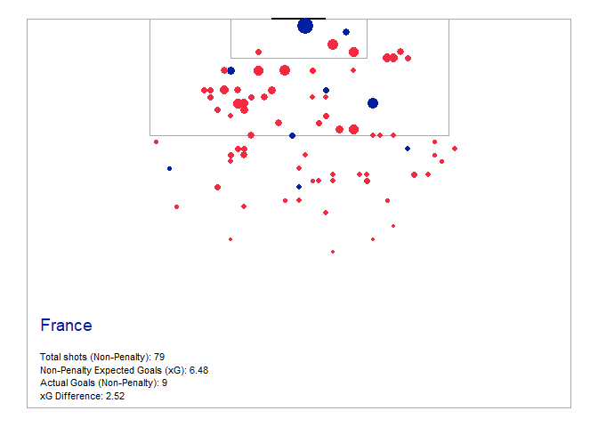

Examining France at WC 2018
================

-   [Data Import and Tidying](#data-import-and-tidying)
    -   [Get Events Data](#get-events-data)
    -   [Add Minutes Played](#add-minutes-played)
    -   [Tidy Location Data](#tidy-location-data)
    -   [Variable Calculation](#variable-calculation)
-   [Investigation](#investigation)
    -   [Team: Shots per match](#team-shots-per-match)
    -   [France: Shot Map](#france-shot-map)
-   [Source](#source)

Nick D. Ungson

**Last updated:** 2018-11-18 15:26:00

Below, I use some procedures and concepts described by FC rSTATS during our meeting on 2018-11-08 (and on their website) to examine France's performance at the *2018 FIFA World Cup*.

Data Import and Tidying
=======================

Get Events Data
---------------

Below, I load the necessary packages for analyses. To facilitate processing, I commented out code that uses StatsBombFreeEvents() to get data from SB and instead import `"events.RDS"`, which was saved from SB on 2018-11-18.

``` r
#devtools::install_github("statsbomb/StatsBombR")
require(StatsBombR)
require(tidyverse)
require(FC.rSTATS)

# load event data
#events <- StatsBombFreeEvents()
# save events as .RDS
#saveRDS(events, "events.RDS")

events <- readRDS("events.RDS")

# select only World Cup 2018 data
events <- events %>% filter(competition_id == 43)
```

Add Minutes Played
------------------

Below, I use the `get.minutesplayed(events)` function to get all timing data per player, calculate a total minutes player variable, which is then appended onto the larger `events` dataframe using `merge()`.

``` r
# get timing data per player
time.data <- get.minutesplayed(events)

# sumarise as total minutes played 
min.played.per.player <- time.data %>% 
  group_by(player.name) %>% 
  summarize(tot.min.played = sum(minutes.played))

# merge: add total minutes to events dataframe 
events <- merge(events, min.played.per.player, by = "player.name")

rm(time.data, min.played.per.player)
```

Tidy Location Data
------------------

Since StatsBomb data `$location` (i.e., pass orgin, shot location) consists of a list of c(., x, y), the following code separates that into a separate `x` and `y` variables.

``` r
events <- events %>% 
  separate(location, c("extra.location","x","y")) %>% 
  select(-extra.location) %>% 
  mutate(x = as.numeric(as.character(x)), 
         y = as.numeric(as.character(y)))

# do same for pass end location
events <- events %>% 
  separate(pass.end_location, c("extra.location","pass.end.x","pass.end.y")) %>% 
  select(-extra.location) %>% 
  mutate(pass.end.x = as.numeric(as.character(pass.end.x)), 
         pass.end.y = as.numeric(as.character(pass.end.y)))
```

Variable Calculation
--------------------

``` r
events <- events %>% 
  mutate(type.name = ifelse(type.name == "Pass" & 
                              pass.length >= quantile(events$pass.length, probs = c(0.95), na.rm = T), 
                            "pass_long", type.name)) %>% 
  mutate(type.name = ifelse(type.name == "Pass" & 
                              pass.end.x >= 102 & pass.end.y > 18 & pass.end.y < 62, 
                            "pass_into_box", type.name)) %>% 
  mutate(type.name = ifelse(type.name == "Shot" & x >= 102 & y > 18 & y < 62, 
                            "shot_in_box", type.name)) %>% 
  mutate(type.name = ifelse(type.name == "Shot" & x < 102 & (y < 18 | y > 62), 
                            "shot_out_box", type.name)) %>%
  mutate(type.name = ifelse(type.name == "Pressure" & x >= 80, 
                            "pressure_high", type.name))
```

Investigation
=============

Team: Shots per match
---------------------

Display all teams at the World Cup and sort by number of shots per match.

``` r
events %>% 
  filter((type.name == "Shot" | 
            type.name == "shot_in_box" | 
            type.name == "shot_out_box") & 
  shot.type.name != "Penalty") %>% 
  group_by(team.name) %>% 
  summarize(matches = length(unique(match_id)), 
            shots_total = round(n()), 
            shots_per_match = round(n() / matches, 0)) %>%
  arrange(desc(shots_per_match)) %>% 
  print(n = 32)
```

    ## # A tibble: 32 x 4
    ##    team.name    matches shots_total shots_per_match
    ##    <chr>          <int>       <dbl>           <dbl>
    ##  1 Germany            3          73              24
    ##  2 Brazil             5         103              21
    ##  3 Spain              4          72              18
    ##  4 Croatia            7         112              16
    ##  5 Belgium            7         107              15
    ##  6 Mexico             4          61              15
    ##  7 Argentina          4          57              14
    ##  8 Portugal           4          56              14
    ##  9 Switzerland        4          55              14
    ## 10 England            7          93              13
    ## 11 Morocco            3          39              13
    ## 12 Nigeria            3          38              13
    ## 13 Uruguay            5          63              13
    ## 14 Serbia             3          35              12
    ## 15 Tunisia            3          37              12
    ## 16 Australia          3          32              11
    ## 17 France             7          79              11
    ## 18 Iceland            3          34              11
    ## 19 Japan              4          43              11
    ## 20 Peru               3          32              11
    ## 21 Poland             3          32              11
    ## 22 Saudi Arabia       3          33              11
    ## 23 South Korea        3          34              11
    ## 24 Sweden             5          56              11
    ## 25 Colombia           4          41              10
    ## 26 Denmark            4          40              10
    ## 27 Egypt              3          30              10
    ## 28 Russia             5          49              10
    ## 29 Senegal            3          29              10
    ## 30 Costa Rica         3          27               9
    ## 31 Panama             3          24               8
    ## 32 Iran               3          22               7

France: Shot Map
----------------

First, subset data to only include shots by France.

``` r
fr.data <- events %>% 
  filter(team.name == "France" & 
           (type.name == "Shot" | 
              type.name == "shot_in_box" | 
              type.name == "shot_out_box") & 
           shot.type.name != "Penalty")

# add goal count to help plotting
fr.data$goal <- ifelse(fr.data$shot.outcome.name == "Goal", "1", "0")
```

Now add to shot map (created using `create_StatsBomb_ShotMap()`, a function modified from [FC r STATS](https://github.com/FCrSTATS/StatsBomb_WomensData/blob/master/3.CreateShotMaps.md).

``` r
# read function
source("functions/create_StatsBomb_ShotMap.R")

fr.plot <- create_StatsBomb_ShotMap("#ffffff", "#A9A9A9", "#ffffff", "#000000") 

fr.plot + geom_point(data = fr.data, aes(x = y, 
                                y = x, 
                                size = shot.statsbomb_xg, 
                                color = goal)) + 
  theme(legend.position = "none") + 
  scale_color_manual(values = c("#F42A41", "#00209F")) + 
  geom_text(aes(x = 2, y = 73, label = fr.data$team.name[1]), 
            hjust = 0, vjust = 0.5, size = 5, colour = "#00209F") + 
  geom_text(aes(x = 2, y = 68, label = paste0("Total shots (Non-Penalty): ", 
                                            nrow(fr.data))), 
            hjust = 0, vjust = 0.5, size = 3) + 
  geom_text(aes(x = 2, y = 66, 
                label = paste0("Non-Penalty Expected Goals (xG): ", 
                               round(sum(fr.data$shot.statsbomb_xg), 2))), 
            hjust = 0, vjust = 0.5, size = 3) + 
  geom_text(aes(x = 2, y = 64, 
                label = paste0("Actual Goals (Non-Penalty): ", 
                               round(sum(as.numeric(fr.data$goal)), 0))), 
            hjust = 0, vjust = 0.5, size = 3) + 
  geom_text(aes(x = 2, y = 62, 
                label = paste0("xG Difference: ", 
                               round(sum(as.numeric(fr.data$goal)), 0) - 
                                 round(sum(fr.data$shot.statsbomb_xg), 2))), 
            hjust = 0, vjust = 0.5, size = 3)
```



Source
======

All data above from StatsBomb.


