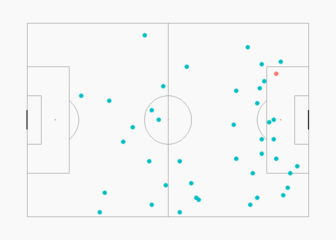
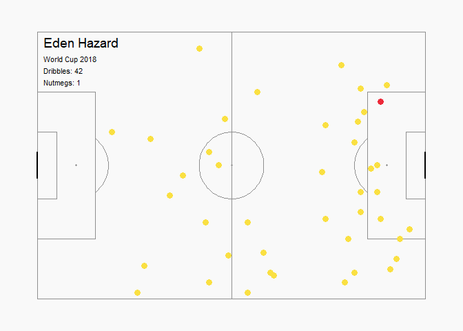

Plotting Eden Hazard's dribbles at the 2018 World Cup
================
Nick D. Ungson
September 16, 2018

Below, I plot all of Eden Hazard's (BEL) dribbles from the *2018 FIFA World Cup* using [StatsBomb open data](https://github.com/statsbomb/open-data). Code inspired by [FC rStats](https://twitter.com/FC_rstats/status/1040200334499565569)

Setup
=====

First, load required libraries and import data.

``` r
library(tidyverse)     # data tidying
library(StatsBombR)    # importing sb data
library(SBpitch)       # for creating pitch
library(RColorBrewer)  # figure colors
library(magick)        # applying logo

events <- StatsBombFreeEvents()
```

"Events" contains all World Cup matches provided by StatsBomb, but also matches from the 2018 NWSL season and select matches from the FA WSL. Since I only care about Eden Hazard's dribbles, I'm going to select only rows corresponding to them. Additionally, location is stored in StatsBomb data as a vector of \[x,y\] coordinates, so I have to also separate this variable into individual *x*,*y* columns for plotting. I also convert coordinates to numeric values, which also helps for plotting.

``` r
data <- events %>% 
  filter(competition_id == "43" & 
           player.name == "Eden Hazard" &
           type.name == "Dribble")

data <- data %>% separate(location, c("location.spare", "x", "y"))
data$x <- as.numeric(as.character(data$x))
data$y <- as.numeric(as.character(data$y))
```

Plotting
========

I want to plot dribbles with dots, but just for fun, I also want to differentiate by color which dribbles were nutmegs (a.k.a., panna). For this plot, I will use the color codes for the Belgian flag ([scheme color](https://www.schemecolor.com/wp-content/themes/colorsite/include/cc3.php?color0=000000&color1=fae042&color2=ed2939&pn=Belgium%20Flag%20Colors)). First, I assign the color codes to a vector, then add column names that will eventually corespond to the values within the nutmeg variable `data$dribble.nutmeg`. However, as you can see below, `data$dribble.nutmeg` consists of NA and TRUE so I'll be using is.na() to identify nutmegs; that's why FALSE will correpond to the succesful nutmegs and TRUE will correspond to non-nutmegs vis-a-vis color codes.

``` r
data$dribble.nutmeg
```

    ##  [1]   NA   NA   NA   NA   NA   NA   NA   NA TRUE   NA   NA   NA   NA   NA
    ## [15]   NA   NA   NA   NA   NA   NA   NA   NA   NA   NA   NA   NA   NA   NA
    ## [29]   NA   NA   NA   NA   NA   NA   NA   NA   NA   NA   NA   NA   NA   NA

``` r
belgcolor <- c("#ED2939", "#FAE042")
names(belgcolor) <- c("FALSE", "TRUE")
colscale <- scale_color_manual(name = "dribble.nutmeg", values = belgcolor)
```

Okay time to plot! First, I'll plot Hazard's dribbles on a pitch (made using FC rStats's create\_Pitch function) and use the R default colors to highlight nutmegs.

``` r
create_Pitch() + 
  geom_point(data = data, aes(x = x, y = y, color = is.na(dribble.nutmeg)), size = 3) + 
  theme(legend.position = "none")
```



Looks good! But now I'll add `colscale` to use the Belgian colors for the points and also add a few labels: Player name, competiion, number of dribbles, and number of nutmegs.

``` r
create_Pitch() + 
  geom_point(data = data, aes(x = x, y = y, color = is.na(dribble.nutmeg)), size = 3) + 
  theme(legend.position = "none") + 
  colscale + 
  geom_text(aes(x = 2, y = 77, label = data$player.name[1]), 
            hjust = 0, vjust = 0.5, size = 5) + 
  geom_text(aes(x = 2, y = 72, label = "World Cup 2018"), 
            hjust = 0, vjust = 0.5, size = 3) +
  geom_text(aes(x = 2, y = 68.5, 
                label = paste0("Dribbles: ", 
                               nrow(data))), 
            hjust = 0, vjust = 0.5, size = 3) + 
  geom_text(aes(x = 2, y = 65, 
                label = paste0("Nutmegs: ", 
                               sum(!is.na(data$dribble.nutmeg)))), 
            hjust = 0, vjust = 0.5, size = 3)
```


